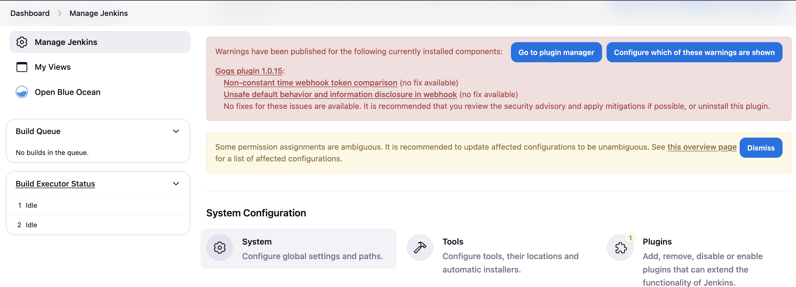

**Introduction**

In the previous step, you have manually installed the application and test it with the browser and curl.  To replicate it in an automated way, by setting up a CI/CD pipeline, please follow the complete instructions here: https://github.com/fharris/curiositymonolith/blob/main/automatic-deployment.md. You will certainly have a lot of fun doing it. In the end, you should be able to have an ecosystem containing a CI/CD toolchain powered by Jenkins and completely integrated with Gogs as a local Git server and Registry as a local Docker registry server. There is also a MySQL database running locally as a container. There is also a Dind or Docker in Docker container which is needed to help Jenkins container build containers. Everything will be running as a container inside a docker network called cloudnative network  For the runtime or the target against which Jenkins will be deploying, we are going to continue to use Kubernetes.  You can also see in the diagram the IP addresses for the cloudnative docker network (CIDR 172.18.0.0/16, which is predefined and shouldn’t change for you) and the Kubernetes cluster API (in our case 192.168.5.15:6443 and should almost certainly be different for you). Jenkins is the Master of Ceremony and will be responsible for managing builds and deployments. The exercises you are about to follow will test the efficiency of the CI/CD pipeline. The next Figure illustrates step-by-step, from 1 to 4, the flow of events that we need to learn to see how a change in the application's code will trigger the CI/CD toolchain and deploy a new version of the application. 


**Requirements**

*16 GB RAM* (The Jenkins container in particular needs a bit more resources then the other. So, make sure that you have that available if you start noticing Jenkins slower than it should ;))

*Access to a Kubernetes cluster*

*kubectl* 

*git* 

*jq*

*MySQL client*

*docker*


**Get the code from GitHub**

If you haven't done so, get the code from the repository:
```
git clone https://github.com/fharris/curiositymonolith
```
Change to the curiositymonolith folder and run the following commands:

If we already tried this exercise before, or have installed the application manually, please run the following 2 scripts for housekeeping:

```
./housekeeping-k8s.sh
```

```
./housekeeping-docker.sh
```
1. **Take note of the kube proxy API endpoint.**

If you are running this exercise with a Kubernetes cluster whose API is a public IP or a private IP behind a public jump machine, then you just need to take note of that IP. If you are running this with a local Kubernetes cluster then you can just follow the next steps to get the IP of your local Kubernetes cluster.

In a tab run the command:

``
kubectl proxy &
``
Open another tab and run the following command:
``
curl localhost:8001/api
``
And you should get the Server address. 


You will need to update this value later in Jenkins env vars.

1. **Create a namespace for the application and Jenkins user credentials**

```
./jenkinsconfiguration-k8.sh
```

2. **Create local network and containers**

We will create a docker network (we could do this with docker composer as well, but for now let's keep it like that) and provision 5 containers that will help us recreate a simplified cloud native ecosystem. A first container with Docker Dind which allows us to build and run containers from within containers. A second container with Jenkins where the CI/CD pipelines to build and deploy the application will be configured. A third container with Gogs, a simple git Server where our code will reside and be synchronized with the Jenkins pipelines. A fourth container with a local mysql database, which we will use to help us on the builds. A fifth container with a local docker registry where the lifecycle of our application image will be managed and Kubernetes pull it to launch. Remember that this exercise is pedagogical and has an educational goal. It's important if you want to learn how things work behind the scenes.

Run the script:
```
./CICD/containers-run-config.sh
```
At some point, you will see the screen below and the script will stop and wait for the Gogs server configuration. 


Follow the next instructions to configure Gogs and when finished, return to the script in the terminal, and press Enter to resume the configuration of the other containers:

3. **Configure local Git server**

The Gogs container is running on *http://localhost:10880*. Copy past that hostname:port on your browser and start the configuration. The first time you run it, you will get a special screen for the database set-up. Make sure that you select **SQLite3** and keep the **Path** as it is as illustrated in the next figure.


                                

Below, in the Application General Settings please change the default Branch from **master** to **main** : as illustrated next:


Now on the optional settings, you will need to define an admin user called gogs-user. Take note of the password you are going to use. The email is optional. Click the blue button **Install Gogs** and follow figure gogs3 for more details:


**Figure gogs3**

Now is the moment to return to the terminal and resume the script by pressing **ENTER**. 


Let the script run to the end and confirm that all containers are running. You need **jq** installed to run the following command:

**[optional]**
```
docker network inspect cloudnative | jq '.[].Containers'
```

you should see the docker network cloudnative with 5 containers running, each showing their respective hostnames and local IP addresses:


Get back to the Gogs Console in the browser. Just retype  [http://localhost:10880](http://localhost:10880) and sign in with the user **gogs-user** and the password you created before. 

Click the little plus "+" signal next to your avatar and select New Migration:


Follow Figure gogs5 and replace the Clone Address with the GitHub address of the original repository which is [https://github.com/fharris/curiositymonolith](https://github.com/fharris/curiositymonolith) . The owner will be **gogs-user** and the name should be the **curiositymonolith** as well.


After clicking the green button to start the migration, if all goes well, you should be able to see your codebase at [http://localhost:10880/gogs-user/curiositymonolith](http://localhost:10880/gogs-user/curiositymonolith) .

We will now configure Webhooks for the Gogs-Jenkins communication. From your codebase click Settings (the little tools icon on the top right of the screen) or navigate directly to [http://localhost:10880/gogs-user/curiositymonolith/settings](http://localhost:10880/gogs-user/curiositymonolith/settings) . Click Webhooks, and Add a New Webooks of type Gogs as per next figure:


Replace the Payload URL with [http://jenkins:8080/gogs-webhook/?job=buildcuriosity](http://jenkins:8080/gogs-webhook/?job=buildcuriosity) which is where Jenkins CI/CD will be waiting for Gogs notifications. Make sure the Content-Type is application/json, and that there is no Secret configured. Before clicking the green button to create the Webhook ensure the Just the Push event option is selected and the Active box is enabled. Next figure  shows how to do it:


If all goes well, you should get something as Figure gogs8. Click the link for the webhook (should be [http://jenkins:8080/gogs-webhook/?job=buildcuriosity](http://jenkins:8080/gogs-webhook/?job=buildcuriosity) ).


Figure gogs8

Now, as illustrated in Figure gogs9, inside the webhook configuration you will see a little Test Delivery button on the right bottom of the screen. If you click it you should get a successful test and an event as just been delivered to your local Jenkins:


Figure gogs9


4. **Configuring Jenkins**

This Jenkins container has all the CI/CD pipelines already configured for you to use. All is managed as code from the code base repository  (the buildcuriosity.groovy and deploycuriosity.groovy). Navigate with your browser to localhost:8080 and sign in with the user we prepared for you which is **admin** with password **123**. Skip all the steps related to plugin installation or related to the creation of new users.


Close this and ignore


Start using Jenkins


Once logged in you should see Jenkins with 3 jobs configured. The job curiosity should have at least a failed build which was triggered when you tested the Gogs Webhook. The first run takes a few minutes.


Figure jenk1

We must update a couple of things first. The Kubernetes token for the Jenkins Service Account, the local MySQL password to the **curiosity** user, which is **Welcome#1** and the Kubernetes endpoint.


In Manage Jenkins,  Click Credentials:


**Update Kubernetes token:**


Select the jenkins-token-kubernetes to edit and replace with the token you generated before.


If you don't remember the token run the following command to get it again:

```
kubectl get secrets jenkins-task-sa-secret -o json | jq -Mr '.data["token"]' | base64 -D
```
and after clicking Update, replace the secret with it:


Click Save.

**Update Local MySQL password:**

Repeat the exercise for the MySQL database.

Select the id-mysql credential to update:


Keep the username curiosity and replace the password with Welcome#1    :


Click Save.

**Update Kubernetes API Proxy endpoint**

In Manage Jenkins, click System or go directly to http://localhost:8080/manage/configure :



Search the environment variables and update with the server address of your kubernetes cluster:


Click Save.


Back to the Dashboard schedule a build for the job **buildcuriosity** as we need to generate an image to pull to the local container repos:


When the job is finished, if the Building Image step is green 


and its logs show that the image was pushed to the local repository, then we should be OK to continue:


Return to the Dashboard and run the **configurecuriosity** job to install the application and database in Kubernetes:


if the jobs fails, give it a new try because there is a command that takes a bit longer to run the first time it runs...


Once the job runs successfully if you run the following command, you should see the application running in your browser at **HTTP://localhost:9000** :

```
kubectl -n curiositymonolith port-forward svc/curiositymonolith-service-lb 9000:80
```


And that's it!!

The application is running and the CICD with Jenkins its ready! 
Try to clone the code and make some changes to see the CI/CD being triggered now!

Have fun!
